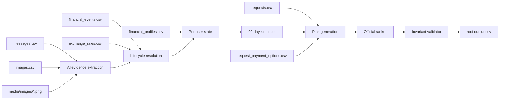

# 02 — Dataset and Data Model

All facts below were verified by direct inspection of the official `dataset/` at commit
`a7b9744` (Phase 0). Row counts are exact. The official dataset is **read-only** for us —
never modified. Interpretation risks are marked; everything else is observation.

## Row counts (verified)

| File | Data rows |
|---|---|
| `requests.csv` | 250 (`request_26`…`request_275`, one distinct user per request) |
| `sample_requests.csv` | 25 (`request_01`…`request_25`, users `user_01`…`user_25`) |
| `financial_profiles.csv` | 275 users |
| `financial_events.csv` | 25,342 events |
| `request_payment_options.csv` | 790 options (2–4 per request) |
| `exchange_rates.csv` | 134 rates |
| `messages.csv` | 215 |
| `images.csv` | 16 |
| `media/images/` | 16 PNGs (`image_01.png`…`image_16.png`) |
| `output.csv` | 250 blank template rows (reference only; final output goes to repo root) |

## requests.csv (evaluation input)

Purpose: the 250 requests to predict. Columns: `request_id, user_id, request_date,
request_type, requested_amount, desired_completion_date, allows_partial_payment, request_text`.

- `request_type` ∈ {purchase, travel, education, family_transfer, debt_repayment, investment, housing, emergency_expense, other} (official, problem_statement.md).
- `allows_partial_payment`: `true`/`false` (80 of 250 are `true`).
- `request_text`: free text (may restate amounts/dates, may be phrased as a question).
- Request dates span 2023-01-20 … 2026-09-04; every `desired_completion_date` is within 90 days of its `request_date` (verified).

Interpretation risk: `request_text` may contain currency-qualified amounts ("ZAR 6,670"); the
authoritative amount is `requested_amount` (official: amounts are in home currency).

## sample_requests.csv

Identical schema plus the 7 answer columns. Official examples of format and decision style.
Used in this project as the regression benchmark (see 07-TESTING-AND-EVALUATION.md), never
as labels for evaluation requests. Notable solved rows are catalogued in
03-FINANCIAL-RULES-AND-INVARIANTS.md §SAMPLE-DERIVED OBSERVATIONS.

## financial_profiles.csv

Purpose: user-level financial position and preferences. PK: `user_id`. Columns:

| Column | Type / semantics |
|---|---|
| `home_currency` | ISO code; all output amounts in this currency. Observed: {USD, ZAR, INR, EUR, IDR} |
| `current_available_balance` | starting available balance for the forecast |
| `minimum_balance_to_keep` | floor the balance must never break (official invariant) |
| `financial_priorities` | `\|`-separated categories (context; no explicit rule assigns it numeric weight — official use is qualitative, see risk note) |
| `expense_categories_to_protect` | protected categories; spending changes may never target them (official: "Respect the user's protected categories") |
| `expense_categories_user_is_willing_to_reduce` | `\|`-separated; reduce_to targets must be here |
| `expense_categories_user_is_willing_to_stop` | `\|`-separated; stop targets must be here |
| `payment_methods_user_will_consider` | `\|`-separated subset of {full_payment, partial_payment, installments}; blank never observed |
| `max_installment_months` | integer; **blank when the user will not consider installments** (official, AGENTS.md §6.1). Blank on 119/275 users |

Nullable: the three category-preference columns can be empty (e.g. `user_06` reduces nothing).
Risk: exact meaning of "months" for `max_installment_months` vs an option's
`number_of_payments × payment_frequency_days` is not officially defined (see 03, ENGINEERING INTERPRETATIONS).

## financial_events.csv

Purpose: historical/pending/future financial facts. PK: `event_id`; FK: `user_id`. Columns:

| Column | Semantics |
|---|---|
| `event_type` | {expense 20,525, subscription 2,488, income 1,696, debt_payment 567, investment_purchase 29, refund 22, investment_valuation 10, investment_sale 5} |
| `description`, `category` | category drives protected/flexible matching |
| `direction` | {debit 23,609, credit 1,723, non_cash 10} |
| `amount` | decimal string; **blank on exactly 16 rows** (all resolvable via images, see below) |
| `currency` | event currency; may differ from home currency → needs FX |
| `event_date`, `settlement_date` | settlement_date blank on 10 rows (all `unrealized`/`non_cash`); FX conversion keys on **settlement date** (official) |
| `status` | {settled 25,148, pending 71, scheduled 70, cancelled 22, failed 21, unrealized 10} |
| `linked_event_id` | FK to an earlier event in the same transaction/investment lifecycle; present on 58 rows; "the link alone does not determine whether a row counts toward cash flow" (official, AGENTS.md §6.1) |
| `flexibility` | {fixed 21,138, reducible 2,682, stoppable 1,297, reducible_or_stoppable 225} |
| `minimum_allowed_amount` | floor for reduce_to; present on 2,907 rows; blank = no stated floor |

Semantics by status (official): treat `settled`, `pending`, `scheduled`, `unrealized`
according to their cash state; do not treat unrealized investment value as available cash;
reserve pending debits; ignore pending credits until settled; ignore cancelled/failed;
detect recurrence only when history supports it.

Observed lifecycle patterns (evidence): refund child of a settled expense parent
(event_98→event_99); retried expense replacing a cancelled parent (event_100 cancelled →
event_101 settled, same amount); pending refund of a settled expense (event_1784→event_1785);
`investment_purchase` (settled debit) → `investment_valuation` (unrealized, non_cash) pairs
(event_1855→event_1856, event_1959→event_1960).

## request_payment_options.csv

Purpose: seller/provider payment options per request. PK: `payment_option_id`; FK: `request_id`.
Columns: `payment_method` ({full_payment, installments}; no partial_payment options observed),
`payment_amount` (per-payment amount), `number_of_payments`, `first_payment_date`,
`payment_frequency_days` (blank for full_payment), `financing_fee`, `total_payable_amount`.

- An available option may still be rejected because it conflicts with the user's payment preferences or `max_installment_months` (official, AGENTS.md §6.1).
- Installment plans must exactly match a supplied option (official).
- Observed invariant: `number_of_payments × payment_amount = total_payable_amount` and `total_payable_amount = requested_amount + financing_fee` on installment options (spot-checked on sample requests 02/07/12/17/22).

## exchange_rates.csv

Purpose: fixed dated FX. Columns `rate_date, from_currency, to_currency, rate`. 134 rows;
pairs observed: USD→INR (33), USD→IDR (30), USD→EUR (25), EUR→USD (24), EUR→ZAR (22);
dates 2023-10-15 … 2026-11-15. Official matching rule: settlement date + stated direction.
Risk: rates are directional (a `to` rate does not imply the inverse row exists at the same date);
chains (e.g. USD→EUR→ZAR) may be needed for pairs not listed directly — no official statement
provides direct rates for every event currency pair, so chain conversion is an engineering
interpretation (see 03).

## messages.csv

Purpose: untrusted supporting evidence. PK: `message_id`; FKs: `user_id`, optional `request_id`,
optional `related_event_id` (populated on 39 rows only — "directly describes one supplied
financial-event row"; official). Columns also: `sent_at` (ISO timestamp), `source_type`
{employer 126, service_provider 31, financial_service 23, bank 18, merchant 17}, `message_text`.

Observed content types (evidence): salary changes effective a future date (message_01:
IDR 42,750,000 from 2025-08-15), one-time adjustments explicitly separated from routine
salary (message_02), bonus "awaiting final approval" (message_03), temporary reduced pay
(message_04), confirmed salary on a specific date (message_05), reduced next salary
(message_06). **Many messages are in Indonesian** — evidence extraction must handle
multilingual text.

## images.csv + media/images/

Purpose: link evidence images to users/requests/events. Columns `image_id, user_id,
request_id, related_event_id`. 16 rows; resolution rule (official): `dataset/media/images/<image_id>.png`.
All 16 blank-amount events in `financial_events.csv` are exactly the 16 `related_event_id`
targets here — the mapping is total and clean. Verified example: `event_253` (user_03,
blank salary, 2019-08-31) ↔ `image_01.png` = pay slip with **Net Pay IDR 4,365,000**
(matching user_03's recurring monthly salary, not the gross earnings line). Other image
descriptions from event rows: rent balance, groceries invoice, telecom bill, hospital bill,
taxi fare, airline ticket, pharmacy, EV charging — i.e. bills/invoices/receipts/pay slips.

Risk: an image may be absent despite a row (official: do not invent evidence); images
contain distractor fields (gross vs net pay, printed dates) and potentially instruction-like
text (untrusted, official rule).

## output.csv (template)

Blank template with the 8 contract columns, pre-filled with the 250 evaluation
`request_id`s. The **final generated file must be the root-level `output.csv`**, not this
template (official, README.md).

## Identifier relationship map

- `user_id` — profiles ↔ events ↔ messages ↔ images ↔ requests (user-level context).
- `request_id` — requests ↔ request_payment_options (2–4 each) ↔ messages (optional) ↔ images (optional).
- `event_id` — financial_events PK; also the value used in `spending_changes_needed`.
- `linked_event_id` — financial_events → financial_events (same user, earlier lifecycle stage).
- `related_event_id` — messages/images → financial_events (one specific event row the evidence describes).
- `payment_option_id` — request_payment_options PK; used only as the ranking tie-breaker; installment plans must match an option row.
- `image_id` — images.csv PK → `dataset/media/images/<image_id>.png`.

## Conceptual data flow

Blank-amount dependency: `financial_events.amount` blank → look up `images.csv` where
`related_event_id = event_id` → open `dataset/media/images/<image_id>.png` → extract the
authoritative amount (e.g. net pay from a pay slip). Never substitute zero.

## Phase 0.5 verification log (additional checks, 2026-09-13)

- Payment options cover **all 275 requests** (25 sample + 250 eval), 2–4 options each; method distribution: `installments` 515, `full_payment` 275 — confirms **no partial_payment options exist anywhere in the dataset** (partial payment never matches an option, consistent with the official rule).
- All 250 evaluation users have both a profile row and event rows (no missing-join risk).
- `request_type` is near-balanced across evaluation requests (27–28 per type of 9 types).
- Broad prompt-injection scan over all 215 messages found **no actual injection content** (28 regex hits were legitimate payroll/financial wording). Injection risk remains open for the 16 images (vision scan happens at Phase 4; see risk R19).
- Upstream re-verified unchanged at Phase 0.5: `main` = `origin/main` @ `a7b9744`.
